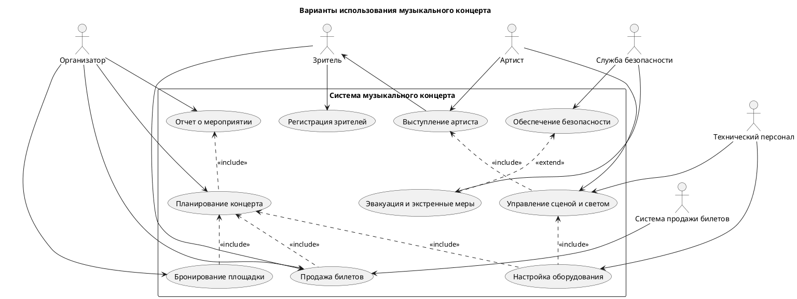
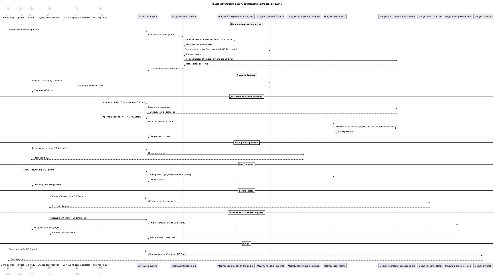
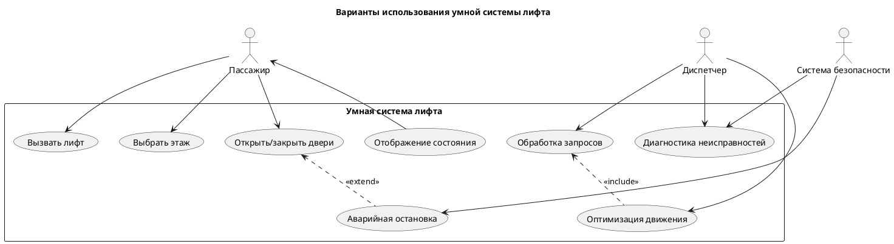
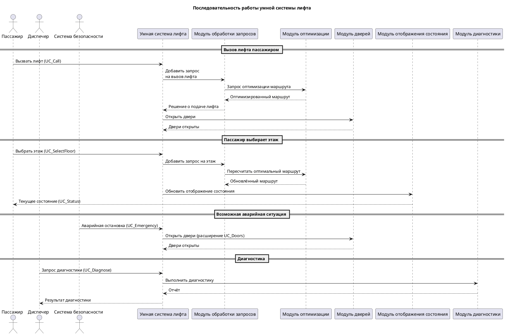

# Петрозаводский Государственный Университет
# **Кафедра Физики Твердого Тела**

## Лабораторная работа по Технологии программирования
### Тема: Создание диаграммы вариантов использования (диаграммы прецедентов)

**Выполнил:** Науменко И.М.
**Проверил:** Лобов Д.В.

---

### Цель:
Разработать диаграмму вариантов использования (Use Case Diagram), в которой будут определены действующие лица и их взаимодействие с системой через соответствующие прецеденты (варианты использования), а также установить взаимосвязи между ними.

### Задача:
- Выделить действующих лиц и прецеденты.
- Создать диаграмму вариантов использования, в которой будут заданы прецеденты и действующие лица.
- Вставить отношения между вариантами использования и действующими лицами.

---

### Диаграмма прецедентов : Музыкальный концерт

---
## 1. Действующие лица (Акторы)

**Организатор** – сотрудник, который отвечает за подготовку и проведение концерта: планирует мероприятие, бронирует площадку, организует продажу билетов и формирует итоговый отчёт.

**Артист** – исполнитель, участвующий в концерте. Участвует в репетициях и выступлениях, взаимодействует с техническим персоналом по вопросам сцены, звука и света.

**Зритель** – посетитель концерта, который покупает билеты, проходит регистрацию и наблюдает выступление артиста.

**Служба безопасности** – сотрудники, обеспечивающие безопасность на площадке, контролирующие вход, порядок во время концерта и действия при чрезвычайных ситуациях.

**Система продажи билетов (внешняя система)** – автоматизированная система, обеспечивающая онлайн-продажу и учёт билетов для зрителей.

**Технический персонал** – специалисты, отвечающие за настройку оборудования, управление сценой, светом и звуком во время концерта.

---

## 2. Прецеденты (Варианты использования)

**Планирование концерта** – позволяет Организатору спланировать концерт, определить дату, место, артистов, составить расписание и предусмотреть технические требования.

**Бронирование площадки** – позволяет Организатору выбрать и забронировать подходящее место для проведения концерта.

**Продажа билетов** – позволяет Организатору и Системе продажи билетов оформить продажу билетов зрителям, вести учёт проданных мест.

**Регистрация зрителей** – позволяет Зрителю пройти проверку билета и регистрацию при входе на мероприятие.

**Выступление артиста** – описывает процесс выступления Артиста на сцене перед зрителями.

**Управление сценой и светом** – позволяет Техническому персоналу координировать работу освещения, эффектов и сценического оборудования во время концерта.

**Настройка оборудования** – используется Техническим персоналом для подготовки сцены, звука, света и других технических систем перед мероприятием.

**Обеспечение безопасности** – описывает действия Службы безопасности по охране порядка и предотвращению нарушений.

**Эвакуация и экстренные меры** – выполняется Службой безопасности в случае чрезвычайной ситуации и расширяет процесс обеспечения безопасности.

**Отчет о мероприятии** – позволяет Организатору проанализировать итоги концерта, составить финансовый и организационный отчёт.

---

## 3. Связи между акторами и прецедентами

- **Организатор** участвует в прецедентах:
  *Планирование концерта*, *Бронирование площадки*, *Продажа билетов*, *Отчет о мероприятии*.

- **Артист** участвует в прецедентах:
  *Выступление артиста*, *Управление сценой и светом*.

- **Зритель** участвует в прецедентах:
  *Продажа билетов*, *Регистрация зрителей*, а также наблюдает *Выступление артиста*.

- **Служба безопасности** участвует в прецедентах:
  *Обеспечение безопасности*, *Эвакуация и экстренные меры*.

- **Система продажи билетов (внешняя система)** участвует в прецеденте:
  *Продажа билетов*.

- **Технический персонал** участвует в прецедентах:
  *Настройка оборудования*, *Управление сценой и светом*.

## Диаграмма последовательности 

---

### Диаграмма прецедентов : Умная система лифта

---

## 1. Действующие лица (Акторы)

**Пассажир** – пользователь лифта, который вызывает лифт, выбирает этаж, управляет дверями и наблюдает состояние системы (текущий этаж, направление).

**Диспетчер** – оператор, следящий за работой системы лифтов, управляющий обработкой запросов, оптимизацией маршрутов и диагностикой неисправностей.

**Система безопасности** – внешний модуль, который реагирует на аварийные ситуации, инициирует аварийную остановку и участвует в диагностике неисправностей.

---

## 2. Прецеденты (Варианты использования)

**Вызвать лифт** – позволяет Пассажиру вызвать лифт на нужный этаж.

**Выбрать этаж** – позволяет Пассажиру выбрать этаж для поездки после входа в лифт.

**Открыть/закрыть двери** – позволяет Пассажиру управлять дверями (например, открыть при посадке или закрыть вручную).

**Отображение состояния** – отображает текущее состояние лифта (этаж, направление, загрузку) для Пассажира.

**Обработка запросов** – основной процесс системы, принимающий и обрабатывающий все входящие команды (вызовы, выбор этажей и т. д.).

**Оптимизация движения** – дополнительный процесс, включаемый в обработку запросов для рационального распределения лифтов и сокращения ожидания.

**Аварийная остановка** – активируется системой безопасности при обнаружении угрозы или неисправности; может также приостанавливать управление дверями.

**Диагностика неисправностей** – используется для анализа состояния оборудования, поиска и устранения ошибок в системе.

---

## 3. Связи между акторами и прецедентами

- **Пассажир** участвует в прецедентах:
  *Вызвать лифт*, *Выбрать этаж*, *Открыть/закрыть двери*, *Отображение состояния*.

- **Диспетчер** участвует в прецедентах:
  *Обработка запросов*, *Оптимизация движения*, *Диагностика неисправностей*.

- **Система безопасности** участвует в прецедентах:
  *Аварийная остановка*, *Диагностика неисправностей*.

## Диаграмма последовательности 

